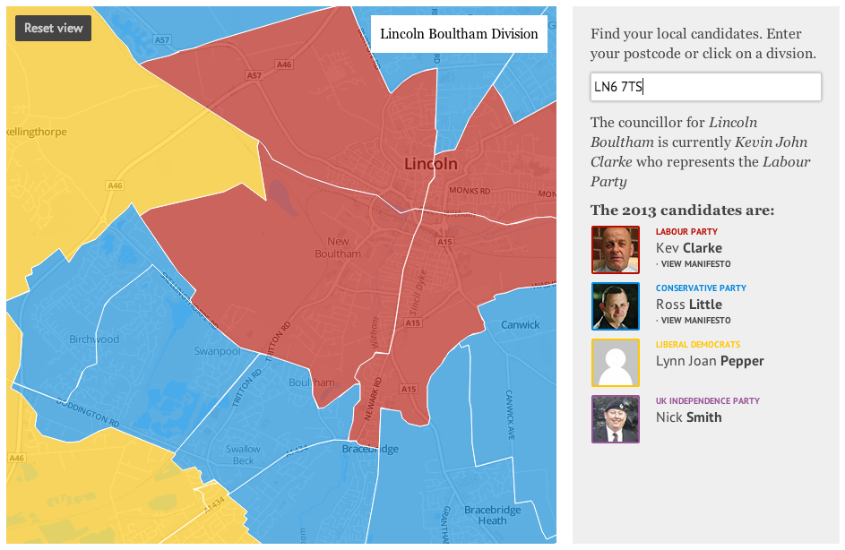

A few weeks ago I was approached by the guys at [The Lincolnite](http://thelincolnite.co.uk) to look into developing an interactive page for the upcoming Lincolnshire County Council elections on the 2nd of May.

Part one launched yesterday and here’s what I’ve come up with:

The map loads GeoJSON representations from all 77 electoral divisions in Lincolnshire County Council and renders them on a custom [Mapbox](http://mapbox.com/) map (which hides a lot of unnecessary map detail such as buildings) using [Leaflet.js](http://leafletjs.com/). Each division is coloured in with the colour of the party that is currently represented in that area. When a user clicks on a district it zooms in and displays in the right hand column the current councillor and a list of the 2013 candidates.

In the right hand column users can also enter their postcode which is sent to [MySociety’s](http://mysociety.org) excellent [MapIt](http://mapit.mysociety.org) service. If the postcode is a real and is in the Lincolnshire County Council area then it will return with the ID of the division which will then zoom the map in and show candidates as above.

I encountered a few challenges along the way. First getting the candidates data was the most labour intense thing I’ve done in a while and there was no easy way to automate it.

Basically the council had a semi-complete spreadsheet of results from 2009 which after a bit of mangling provided me with an initial set of results which I could use to colour the map in (and I will use again for part two of the map). Over 2012 there were two by-elections and I found the results for these not from the council but local newspapers.

To get the 2013 candidates I had to wade through 77 differently formatted (depending on the parent district council) PDFs to manually copy and paste the candidates into my own CSV. One district council didn’t even include the parties the candidates were representing and I had to get this from another CSV provided by the county council (which didn’t include candidates’ first names otherwise I’d just have used that).

The other problem I had was trying to find a javascript mapping library that gave me the flexibility I needed and also wouldn’t grind to a halt when I fed it 77 GeoJSON encoded districts.

I ruled out Google Maps because I couldn’t easily customise the map of Lincolnshire (i.e. remove buildings and make the roads, land and water lighter). Also everyone uses Google Maps and I wanted to play with something different. I tried Mapbox’s own javascript framework with D3.js but that cried when I added more than about 30 divisions. I finally discovered leaflet.js which I really struggled to get my head around the API in order to make it do what I needed but it was very lightweight and the performance is fantastic.

So part one is out, and there’s just under a week to go until the elections which gives me a few days to finish off part two which is when the map will live update when results come in and update swingometers and other funky widgets on the fly.